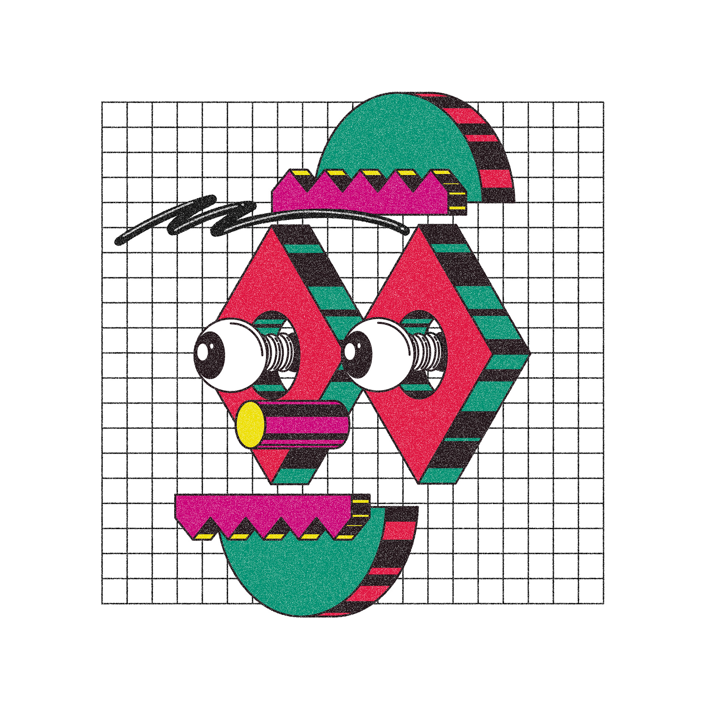
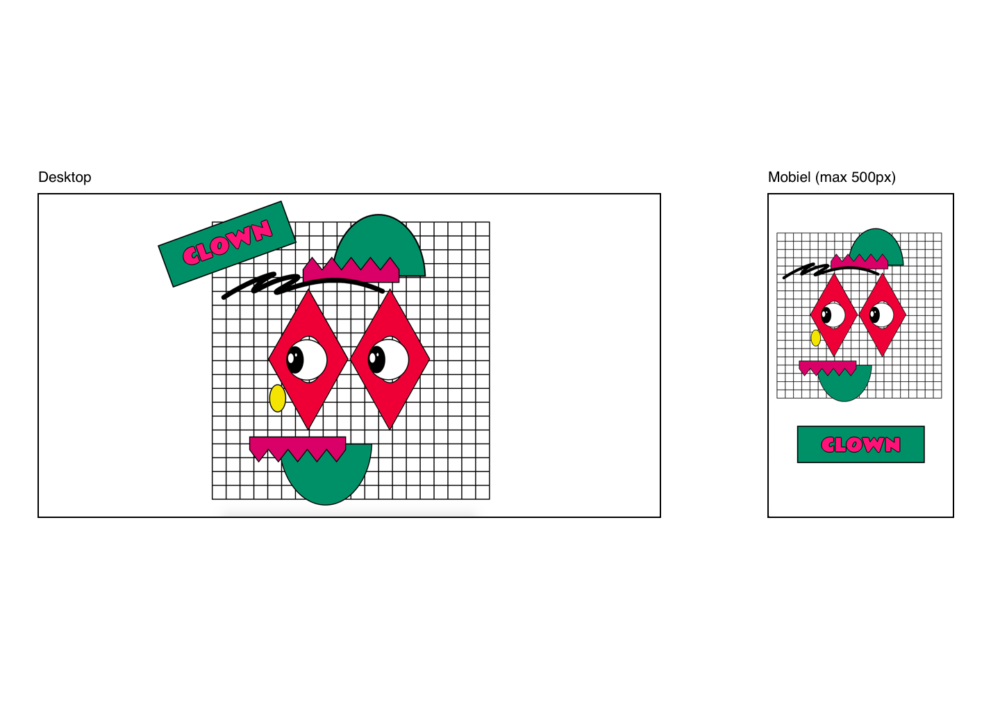

# Web Animatie - Tim de Jong

Kies een kunstwerk (poster, albumhoes etc.) en vertaal dat naar het web. Wat gebeurt er als er met de muis over bepaalde elementen wordt gezweefd? Wat als ze op toetsen op hun toetsenbord drukken? Hoe gedraagt het 'statische kunstwerk' zich  op verschillende schermformaten? 
Verschillende interacties die aan het kunstwerk zijn toegevoegd om het  interessanter te maken en zijn complementair aan het kunstwerk.


## Het kunstwerk


Bron: [Een persoonlijk illustratief experiment van Josep Prat Sorolla](https://www.behance.net/gallery/14475801/Personal-illustration-experiments)

Ik heb een kunstwerk van [Josep Prat Sorolla](https://www.behance.net/gallery/14475801/Personal-illustration-experiments) gekozen. Het is een werk van zijn behance page en hij bestempeld het als 'Personal Illustration experiments'. Ik werd enthousiast door de afbeelding en zijn 3d effect, de kleuren en de stijl van de kunstenaar. Dit wilde mezelf graag uitdagen om dit digitaal verder uit te buiten en ervoor te zorgen dat het een nog interessanter ontwerp zou worden.

## Techniek

De technieken die ik heb gebruikt om het kunstwerk na te maken en interactief te maken zijn:
* Illustrator
* HTML/CSS
* Javascript

Om aan de opdracht te voldoen moet het eindproduct voldoen aan een aantal punten.

###Het moet responsive zijn:


Dit heb ik gedaan door gebruik te maken van MediaQueries:
```
@media screen and (max-width: 1030px) {
  svg{
    width: 150%;
    transform: translate(-250px,-100px);
  }
    p{
      left: -290px;
    }
  }
```

Zo moest de css verschillende transities en animaties bevatten om interactie mee te geven. Er moeten verschillende 'psuedo-classes'. Hier moest mee geexperimenteerd worden.
```
#oog-links_1_ > g > g:nth-last-of-type(1)
{
  left: 20px;
  transform: translate(65px,0px);
  transition: ease .5s;
}
```

En er moest gebruik gemaakt worden van keybindings en clickable items om het kusntwerk interactief te maken. Zo heb ik de spatiebalk gebruikt om een actie toe te voegen aan het kunstwerk. Dit heb ik gedaan met Javascript.

```
var kleur = document.querySelector("body");
window.addEventListener('keydown', toggle)

function toggle (event){
   if(event.keyCode == 32){
      kleur.classList.toggle('kleur');
   }
}

```
```
var button = document.querySelector("g:first-of-type");
console.log(button)

var element = document.getElementById("achtergrond");

button.addEventListener("click", function(){
   element.classList.toggle("background-rotate");
});

```

## Eindproduct


[Eindproduct](https://timdej0ng.github.io/web-animation-19-20/index.html) 

Bekijk hier het interactieve kunstwerk!
* Gebruik de spatiebalk om de kleur te veranderen
* druk op de neus om het 3D te maken
* Druk vlak rechts naast het rechter-oog om de schaduwen te tonen
* druk om de raster om deze te flipen
* hover en click op het naambordje voor een glow effect en een invert color effect.


